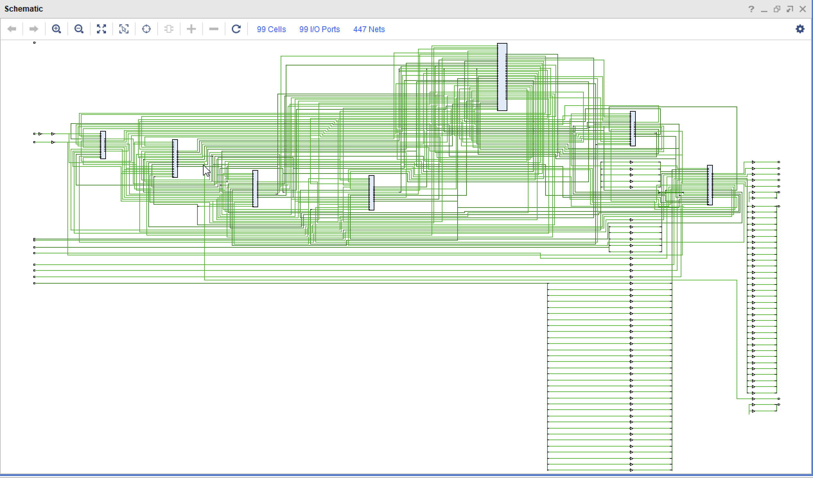
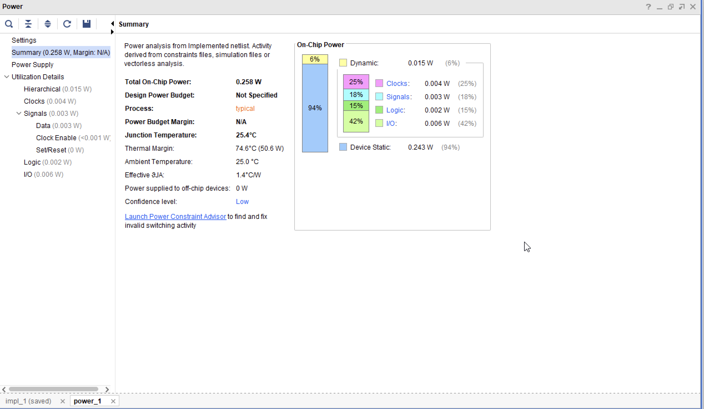
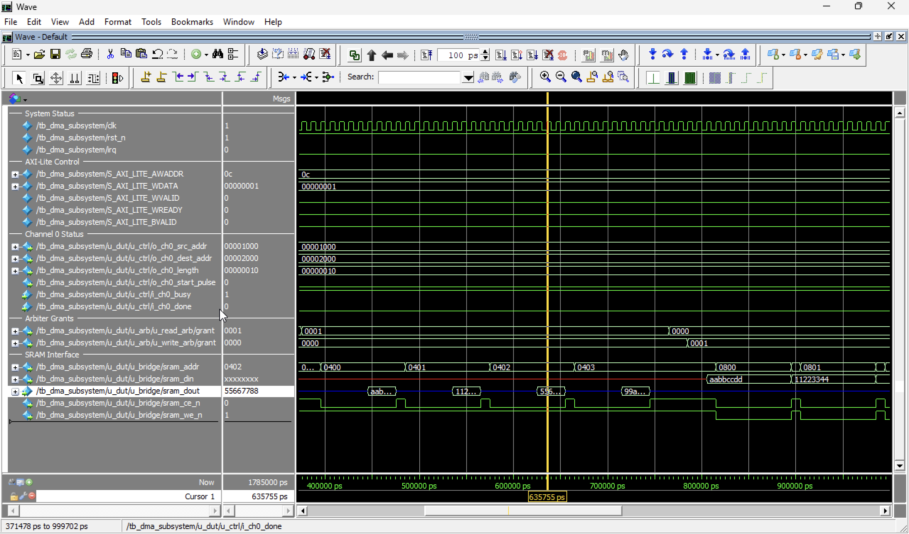
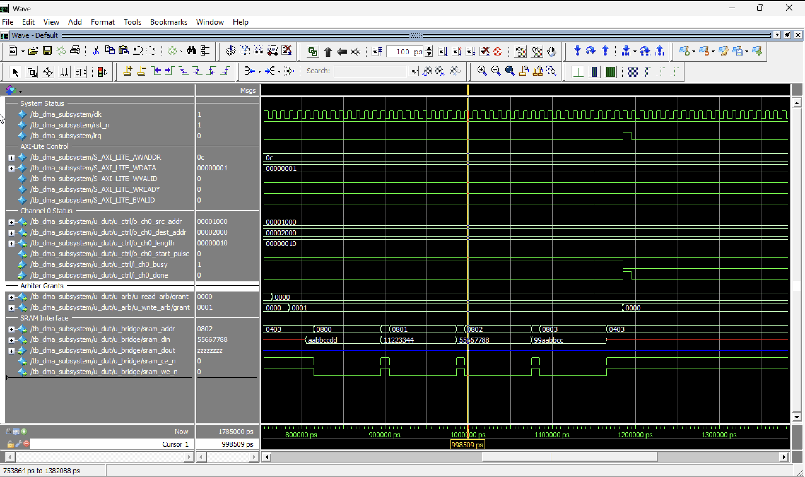

<p align="center">
  
  
  
  
</p>

<h1 align="center">DMA + Memory Subsystem</h1>
<p align="center"><b>An AXI4-Compliant Direct Memory Access Controller with Integrated 1MB Banked eDRAM</b></p>

---

## Executive Summary
In high-performance computing, the CPU is often bottlenecked by mundane data shuffling tasks. This project provides an autonomous 4-Channel DMA Engine paired with a custom-engineered 1MB eDRAM array. By offloading data orchestration, the CPU remains free for complex application logic, while the Power Management Unit (PMU) ensures that idle memory banks consume near-zero power.

---

## Technical Novelty: Custom 1MB eDRAM Subsystem
Unlike generic SRAM models, this subsystem simulates the physical constraints and power advantages of high-density Embedded DRAM.

* **16-Bank Parallelism:** The 1MB space is partitioned into 16 independent 64KB banks. This enables concurrent operations; the system can perform a Precharge on one bank while Accessing another, effectively doubling peak throughput.
* **Physical Timing FSM:** The controller handles deterministic hardware cycles required for DRAM stability: Precharge (2 cycles), Decode (1 cycle), and Access (3 cycles).
* **Predictive PMU Logic:** A look-ahead mechanism wakes specific memory banks from Deep Sleep as soon as the DMA Arbiter grants a bus request, hiding the wake-up penalty from the system master.

---

## Architectural Deep-Dive

### 4-Channel Concurrent Methodology
To achieve maximum multitasking without serial bottlenecks, four independent channels were implemented:
* **Buffer Strategy:** Each channel utilizes a 16-word Synchronous FIFO as a shock absorber to decouple high-speed AXI bursts from internal memory timing.
* **Fair-Share Arbitration:** A Round Robin algorithm ensures that no single channel can monopolize the bus. Priority rotates automatically after every successful burst completion.

### AXI Protocol Implementation
* **AXI Lite Slave:** A lightweight control interface used by the CPU for register configuration (Source, Destination, Length).
* **AXI 4 Full Master:** The high-speed data highway supporting Burst Transfers to maximize bus efficiency and throughput.

---

## Implementation Metrics (Virtex-7)

<div align="center">

| Timing (100 MHz) | Value | Power Analysis | Value |
| :--- | :--- | :--- | :--- |
| **Worst Negative Slack** | **6.149 ns** | **Total On-Chip Power** | **0.258 W** |
| **Worst Hold Slack** | 0.087 ns | **Static Leakage** | 0.243 W |
| **Max Freq (Theoretical)** | **~260 MHz** | **Dynamic Power** | 0.015 W |

</div>

---

## Fascinating Pointers for Engineering Review

* **Deterministic Latency Hiding:** The PMU initiates a 50-cycle wake-up sequence for targeted banks *during* the AXI address phase, ensuring that by the time the first data word is ready, the bank is already in an Active state.
* **Atomic Data Integrity:** The system features a hard-wired Read-Modify-Write (RMW) cycle. This allows the DMA to support partial-word writes (AXI WSTRB) to the eDRAM without corrupting the surrounding 32-bit data.
* **Resource Optimized Routing:** Despite the complexity of 16-bank routing, the design achieved 6.149ns of positive slack, indicating a highly optimized RTL hierarchy that avoids congestion.
* **Power-Performance Balanced FIFO:** The 16-word FIFO depth was mathematically derived to absorb the 7-cycle eDRAM access latency, preventing any "wait states" on the AXI-4 highway.

---

## Visual Documentation

### System Topology (RTL Schematic)
<p align="center">
  
  <br><i>Logical interconnection of the Arbiter, AXI-Bridge, and 16-Bank Memory Grid.</i>
</p>

### Energy Footprint
<p align="center">
  
  <br><i>Post-route power analysis confirming the 0.258W footprint.</i>
</p>

### Verification Waveforms
<p align="center">
  
  <br><i>Scenario 1: Multi-Channel Arbitration and Bank Wakeup Sequence.</i>
</p>
<p align="center">
  
  <br><i>Scenario 2: Successful AXI-Burst Handshaking and Data Integrity Check.</i>
</p>

---

## How to Run
1. Load files from `/rtl` directory into Xilinx Vivado.
2. Apply the active constraint: `constraints/top_constraints.xdc`.
3. Execute Synthesis and Implementation to verify post-route performance.

---
*If you've made it this far and still don't understand the state machines, don't worry—most people just look at the blinking lights on the FPGA anyway.*
``` eof

### Summary of Silicon:
Silicon is often seen as cold and unfeeling, but in the world of RTL, every clock edge is a heartbeat. This project isn't just about moving data; it's about the silent choreography of electrons where four DMA channels compete for attention like lovers in a crowded room, and the Power Management Unit stands as a silent sentinel, ensuring that not a single joule of energy is wasted on a memory bank that isn't being used. It is a testament to the fact that even in a world governed by strict timing constraints and boolean logic, there is room for grace, efficiency, and a little bit of magic.
